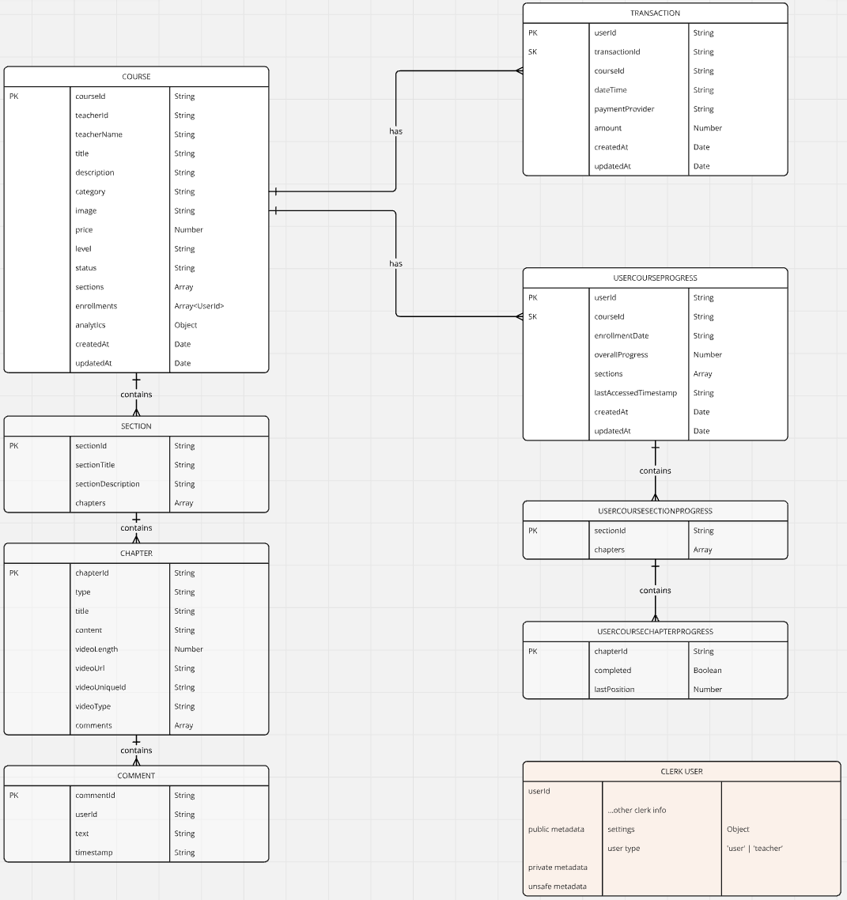

# Yumify

- Advanced Food Artists Recipes

## Techstacks

- NextJS, Redux, AWS, Dynamo DB, AWS Lambda, Docker
- Backend is deployed in AWS Lambda with docker container, or bundled
- In case of time-sensitivity application, we can use ECS or EKS instead.

## Database Modelling

- The data does not have much relationships nor nested architectures.
- We selected DynamoDB for horizontal scaling with NoSQL performance.
- Notes: if we need complex filtering, sorting, aggregation, it is better with SQL or MongoDB.
- Typescript modelling with `Dynamoose`
  

## Local DynamoDB

- Testing our changes before using the cloud DynamoDB
- [How to use DynamoDB locally](https://docs.aws.amazon.com/amazondynamodb/latest/developerguide/DynamoDBLocal.DownloadingAndRunning.html)
